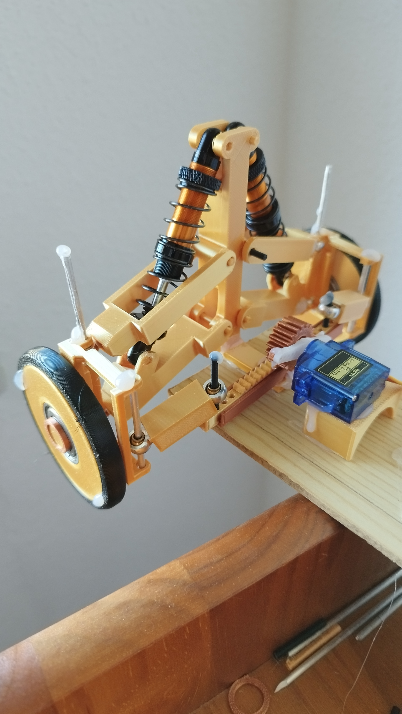
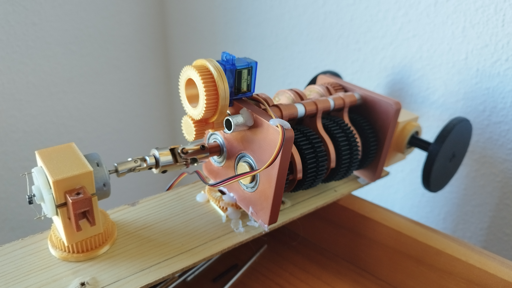
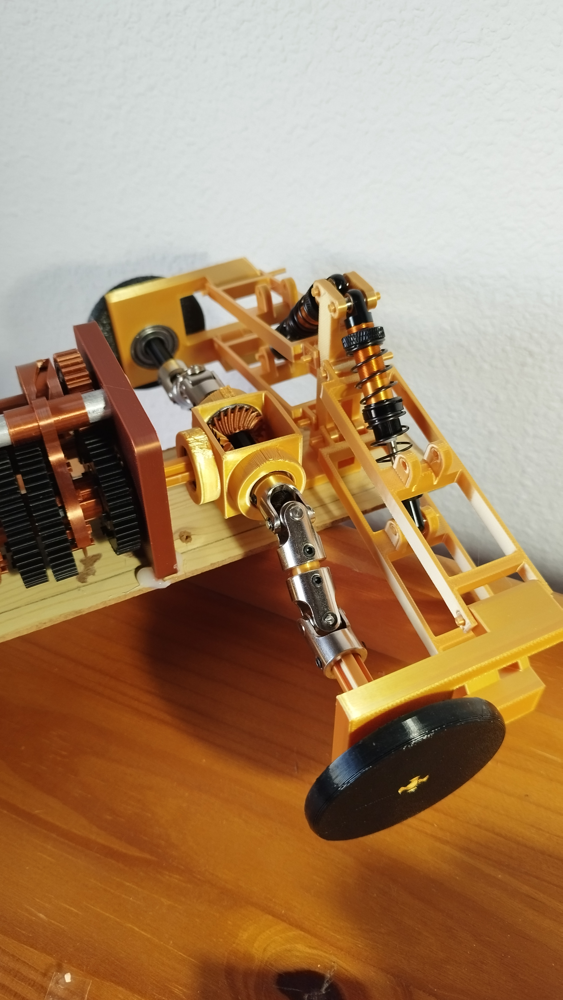
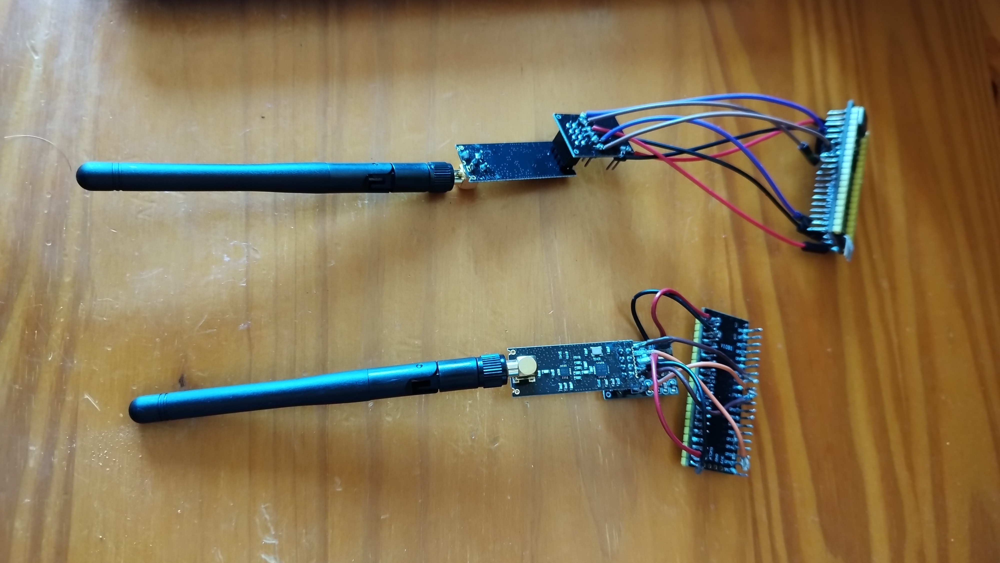

# RC 3D printed car
This project consists of building an RC car using 3D-printed parts, controlled by a Raspberry Pi Pico.

The aim is to design the car using the basic components of a car, such as the chassis, suspension, wheels, transmission, and other essential mechanical parts. Additionally, it will use an RF transmitter to control the car remotely, and it will be programmed using a Raspberry Pi Pico, implementing communication protocols such as UART, I2C, and SPI.

## How it works
Through  a xbox controller and the "xinput.h" library for Windows, the pc will read the buttons and analog joysticks in order to send them at serial port. A Raspberry Pico connected via UART at the same pc will get the data transfered, will decodify it and will send it throught a RF transmitter to another Raspberry Pi Pico located at the car. Finally, this Raspberry Pi Pico will process the data and will convert it to certain values to activate various PWM signals for the motors.

## Hardware
- Raspberry Pi Pico
- NRF24L01 RF transmitter
- Bearings
- Shock absorbers
- Servomotors
- DC motor
- Cardan joints
- Spherical joints

## Images
Direction based on a servomotor, a zipper and shock absorbers:
Acoupling of DC motor to the sequential transmission:
Rear suspension with the differential coupled to the transmission:
RF transmitters used for the telecommunication:

## Tested components
- EEPROM memory: basic read/write functionality verified with I2C protocol. It could be used to save the last gear shift or to save some telemetry.

## Future Improvements
- Improve the mechanical structure to increase stability
- Optimize the mechanical components for better performance
- Add a TFT display to show telemetry (speed, batery level), using the SPI protocol
- Integrate additional sensors

## What i learned
- Use of FreeCAD, a CAD parametric software 
- Compilating projects with CMake and understanding its organization
- C language orientated to microcontrollers and their features, such as configuration, bit masking and processing data
- Protocol communications, such as UART, I2C and SPI
- Understanding technics datasheets
- Troubleshooting hardware issues
